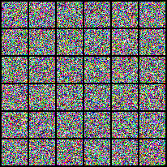

# Diffusion-Road

Toy experiment about image generation

Detail: [Diffusion Road to AIGC](https://zhuanlan.zhihu.com/p/13515967630)

### Datasets Used

* CIFAR10
* 

## Methods

### Flow Matching

* UNet



### DDPM


## ToDo

- [X] Classifier-free Guidance
- [ ] Evaluator
  - [ ] FID
  - [ ] IS
  - [ ] CLIPScore
- [X] Model
  - [X] UNet
  - [X] DiT-AdaLN(-Zero)

## How to Use

```python
python train_by_flow_matching.py --config_file ./configs/flow_matching.yaml
```
